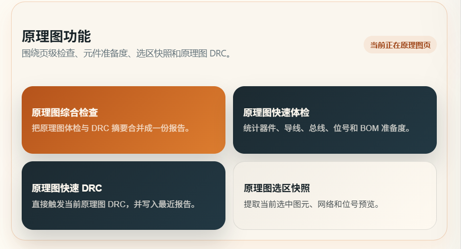
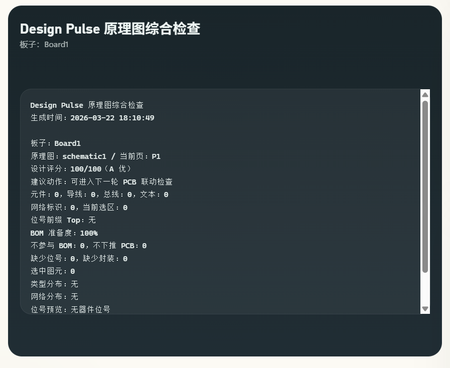
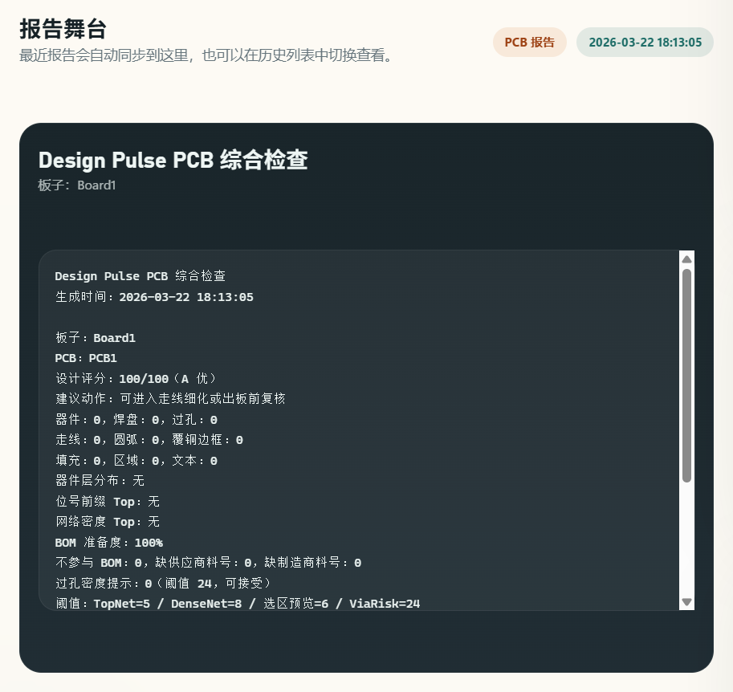
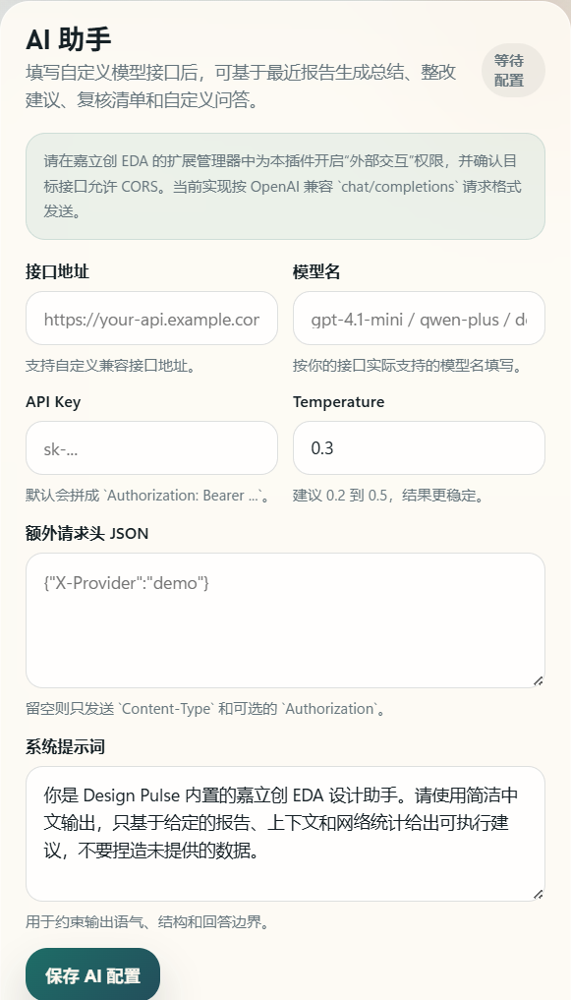

[简体中文](./README.md) | [English](./README.en.md) | [繁體中文](./README.zh-Hant.md) | [日本語](./README.ja.md) | [Русский](./README.ru.md)

# Design Copilot

Design Copilot is a unified workbench extension for JLCEDA. It brings schematic review, PCB review, net debugging, report history, and AI-assisted analysis into one GUI.

## Project Role

This project does not replace the EDA editor itself. It adds a faster inspection and review layer to the design workflow:

- catch designator, footprint, BOM readiness, and DRC issues during schematic work
- inspect components, pads, vias, tracks, copper, and dense nets during PCB work
- keep reusable reports for multi-round comparison
- use a custom model endpoint for summaries, fix suggestions, review checklists, and Q&A

## Main Features

- Unified workbench
  Home, schematic, and PCB menus all expose only `Open Workbench`, so the workflow stays in one place.
- Schematic review
  Includes integrated check, quick audit, schematic DRC, and selection snapshot. It counts components, wires, buses, text, net markers, designator prefixes, missing designators, missing footprints, and BOM readiness, then produces a score with action hints.
- PCB review
  Includes integrated check, quick audit, PCB DRC, selection snapshot, and dense-net analysis. It counts components, pads, vias, tracks, arcs, pours, regions, and text, then evaluates hot nets, missing supplier data, and via risk.
- Net debugging
  The workbench can highlight the densest net automatically, select from the current hot-net list, or focus by net name for power, ground, and critical high-speed routing review.
- Report system
  Integrated checks, audits, DRC runs, and selection snapshots all create unified reports. The workbench shows the latest result and keeps the latest 8 history entries.
- AI Copilot
  Supports a custom endpoint, model name, API key, extra header JSON, system prompt, and temperature. Built-in actions include `Summarize Latest Report`, `Suggest Fixes`, `Build Review Checklist`, and `Custom Prompt`.

## Screenshots

Workbench overview:


Schematic review area:


PCB review area:


Report stage and history:


Settings and AI area:


AI analysis example:


AI custom Q&A example:


## AI Notes

- AI features do not ship with a built-in cloud model; requests use the custom endpoint you provide
- The current payload follows an OpenAI-compatible `chat/completions` format
- Model input is built from the latest report, current document context, hot nets, and active thresholds
- Before using AI, enable the extension's `External Interaction` permission inside JLCEDA

## Build And Package

```bash
npm install
npm run build
```

Packaged `.eext` files are written to `build/dist/`.

## References

- JLCEDA Pro API Guide: <https://prodocs.lceda.cn/cn/api/guide/>
- API Invocation Guide: <https://prodocs.lceda.cn/cn/api/guide/invoke-apis.html>


