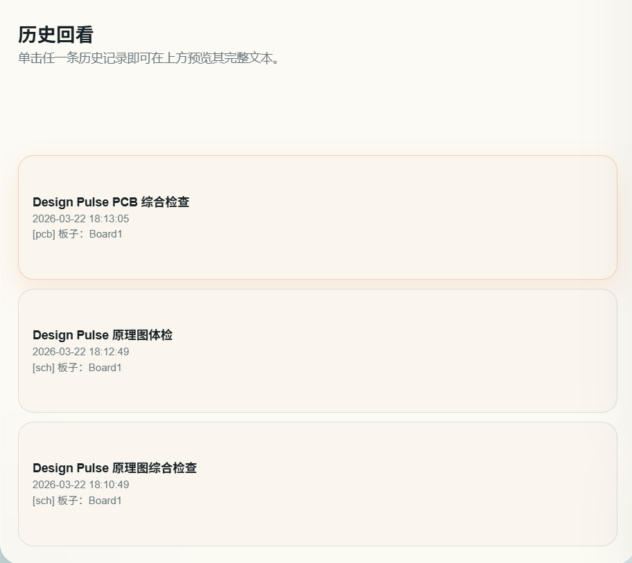
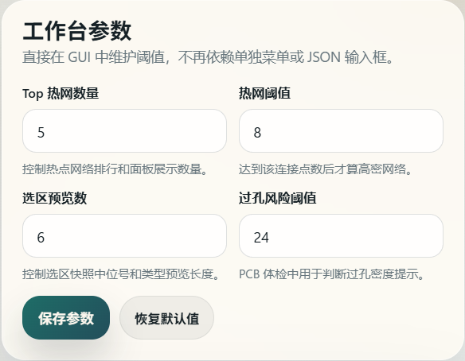

[简体中文](./README.md) | [English](./README.en.md) | [繁體中文](./README.zh-Hant.md) | [日本語](./README.ja.md) | [Русский](./README.ru.md)

# Design Copilot

Design Copilot は、嘉立創 EDA 向けの統合ワークベンチ拡張です。回路図レビュー、PCB レビュー、ネット解析、レポート履歴、AI 支援分析を 1 つの GUI にまとめます。

## プロジェクトの役割

このプロジェクトは EDA 本体を置き換えるものではありません。設計フローに対して、より素早い点検と見直しのレイヤーを追加します。

- 回路図段階で Designator、フットプリント、BOM 準備度、DRC 問題を早く見つける
- PCB 段階で部品、パッド、ビア、配線、銅箔、密集ネットを集中的に確認する
- 複数回のチェック結果を統一レポートとして残し、比較しやすくする
- カスタムモデルのエンドポイントを使って要約、修正提案、レビュー項目、質問応答を生成する

## 主な機能

- 統合ワークベンチ
  Home、Schematic、PCB の各メニューでは `Open Workbench` のみを表示し、操作を 1 か所に集約します。
- 回路図レビュー
  総合チェック、クイック監査、回路図 DRC、選択範囲スナップショットを提供します。部品、配線、バス、テキスト、ネット識別子、Designator 接頭辞分布、未設定 Designator、未設定フットプリント、BOM 準備度を集計し、スコアと推奨アクションを出力します。
- PCB レビュー
  総合チェック、クイック監査、PCB DRC、選択範囲スナップショット、密集ネット解析を提供します。部品、パッド、ビア、配線、円弧、ポア、リージョン、テキストを集計し、ホットネット、供給情報の欠落、ビアリスクを評価します。
- ネット解析
  最密ネットの自動ハイライト、ホットネット一覧からの選択、ネット名による直接フォーカスが可能です。電源網、GND、高速配線の確認に向いています。
- レポート機能
  総合チェック、監査、DRC、選択範囲スナップショットのたびに統一形式のレポートを生成します。ワークベンチは最新結果を表示し、直近 8 件の履歴を保持します。
- AI Copilot
  カスタムエンドポイント、モデル名、API Key、追加ヘッダー JSON、システムプロンプト、Temperature を設定できます。`最新レポート要約`、`修正提案`、`レビュー項目生成`、`自由質問` を利用できます。

## 画面イメージ

ワークベンチ全体：


回路図レビュー領域：


PCB レビュー領域：


レポート表示と履歴：


設定と AI 領域：


AI 分析結果の例：


## AI 利用メモ

- AI 機能に内蔵クラウドモデルはなく、呼び出し先は自分で入力したカスタムエンドポイントです
- 現在のリクエスト形式は OpenAI 互換の `chat/completions` です
- モデルには最新レポート、現在の文書コンテキスト、ホットネット、現在の閾値が渡されます
- 利用前に嘉立創 EDA 側で拡張の `外部連携` 権限を有効にしてください

## ビルドとパッケージ

```bash
npm install
npm run build
```

生成された `.eext` は `build/dist/` に出力されます。

## 参考ドキュメント

- 嘉立創 EDA 拡張 API ガイド: <https://prodocs.lceda.cn/cn/api/guide/>
- API 呼び出しガイド: <https://prodocs.lceda.cn/cn/api/guide/invoke-apis.html>
