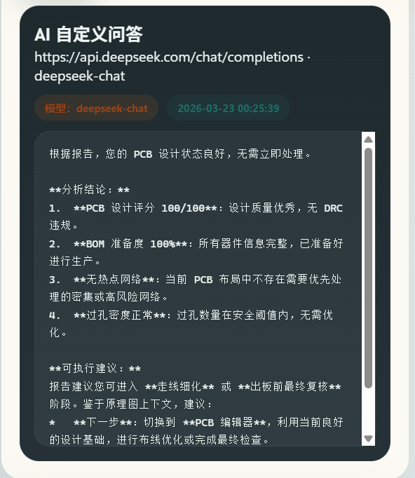

[简体中文](./README.md) | [English](./README.en.md) | [繁體中文](./README.zh-Hant.md) | [日本語](./README.ja.md) | [Русский](./README.ru.md)

# Design Copilot

Design Copilot 是一个面向嘉立创 EDA 的统一工作台插件，用来把原理图检查、PCB 检查、网络排查、报告回看和 AI 辅助分析集中到同一个 GUI 中。

## 项目作用

这个项目的目标不是替代 EDA 本体，而是给设计流程增加一个集中化的工作台：

- 在原理图阶段快速发现位号、封装、BOM 准备度和 DRC 风险
- 在 PCB 阶段统计器件、焊盘、过孔、走线、覆铜和热点网络
- 用统一报告保留多轮检查结果，便于回看和比较
- 用 AI Agent 基于最近报告生成总结、整改建议、复核清单和自定义问答

## 当前功能

- 原理图功能
  当在原理图界面时，支持原理图综合检查、快速体检、原理图 DRC 和选区快照。体检会统计器件、导线、总线、文本、网络标识、位号前缀分布、BOM 准备度、缺位号和缺封装数量，并生成设计评分与建议动作。


你可以在这里生成对原理图分析与检查，获取相关信息。


- PCB 功能
  当在PCB界面时，支持 PCB 综合检查、快速体检、PCB DRC、选区快照和热点网络分析。体检会统计器件、焊盘、过孔、走线、圆弧、覆铜、填充、区域和文本数量，分析热点网络，评估供应链料号完整度与过孔风险，并给出设计评分。

    

- 网络排查工具
  在 PCB 上下文中，可以自动高亮最密网络，也可以从热点网络列表中点选目标高亮，或者按网络名直接聚焦，适合排查电源网、地网和关键高速网。
- 报告系统
  每次综合检查、快速体检、DRC 和选区快照都会生成统一格式的报告。工作台内置报告舞台展示最近结果，并保留最近 8 次历史记录，便于多轮修改后的回看和比较。

    

- 参数维护
  可以在 GUI 中直接维护 `Top 热网数量`、`热网阈值`、`选区预览数` 和 `过孔风险阈值`。这些参数会直接影响报告中的热点网络排行、快照预览长度和 PCB 风险提示。

    

- AI 助手
  在插件右半部分，主要集成了AI功能。你需要在这里填写自定义接口地址、模型名、API Key、额外请求头 JSON、系统提示词和 Temperature。
  当前内置 `总结最近报告`、`生成整改建议`、`生成复核清单` 和 `自定义问答` 四种动作，模型调用时会自动附带最近报告、当前文档上下文、热点网络和当前参数。
  

AI可以根据你的报告进而对你的项目进行分析：



**使用此功能一定要打开外部交互功能（高级>>扩展管理器>>已安装插件>>配置>>打开“外部交互”）**

## 数据来源

- 设计统计来自 `eda.sch_*`、`eda.pcb_*` 和 `eda.dmt_*` 系列 API
- 最近报告、历史记录、参数和 AI 配置保存在 `eda.sys_Storage`
- AI 请求通过 `eda.sys_ClientUrl.request` 发往自定义模型接口

> 使用 AI 助手前，需要在嘉立创 EDA 中为扩展开启“外部交互”权限，并确保目标接口允许 CORS。当前请求格式按 OpenAI 兼容 `chat/completions` 组织。

## To do

- 做一个主题颜色的自定义切换/背景图片切换的功能
- 能够支持一些Agent操作，或者导入MCP/Skills

## 开发与打包

```bash
npm install
npm run build
```

## 参考文档

- 嘉立创 EDA 扩展 API 指南：[https://prodocs.lceda.cn/cn/api/guide/](https://prodocs.lceda.cn/cn/api/guide/)
- API 调用说明：[https://prodocs.lceda.cn/cn/api/guide/invoke-apis.html](https://prodocs.lceda.cn/cn/api/guide/invoke-apis.html)
